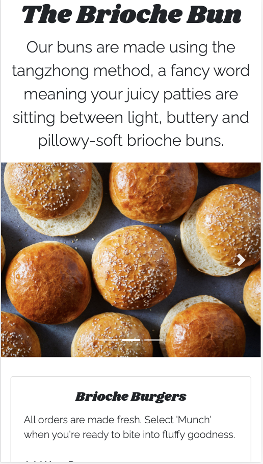
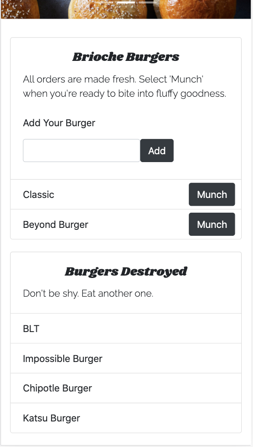

  # The Brioche Bun
  
  
  ## Description 
  The Brioche Bun is a full-stack food application. It is a burger log application that made with MySQL, Node, Express, Handlebars and a custom ORM. Besides the taste, The Brioche Bun follows the MVC design pattern; use Node and MySQL to query and route data, and Handlebars to generate HTML.

  

  ## Table of Contents
  * [Installation](#installation)
  * [Usage](#usage)
  * [License](#license)
  * [Contributing](#contributing)
  * [Test Instructions](#test-instructions)
  * [Questions](#questions)

  ## Installation
    
    1. Download the The-Brioche-Bun repository locally to your computer.   
    2. Run npm install in your bash/command line.

  ## Usage
      
    1. Locate the config folder. Navigate to connection.js and ensure the user, password, and directory is the same as your local SQL workbench. 
    2. To run application, invoke with node server.js or nodemon server.js (recommended) in your bash/command line. 
    3. View the live application in your browser at localhost:8080

  ## License
  MIT (c) Hoang Nguyen   
  See LICENSE.md for details.

  ## Contributing
  Please check the app's GitHub issue tracker for known issues. Report bugs and requests to GitHub Issues.

  ## Test Instructions
  Install and run the application per instructions above. If using nodemon your terminal should display 'Server listening on: http://localhost:8080, connected as id xx'. Front-end changes (e.g. adding or munching burgers) will update on the browser/client.

  ## Questions
  For questions, reach out to me here:  
  Github: https://github.com/hngdngng  
  Email: [hoang.d.nguyen@outlook.com](mailto:hoang.d.nguyen@outlook.com)
  